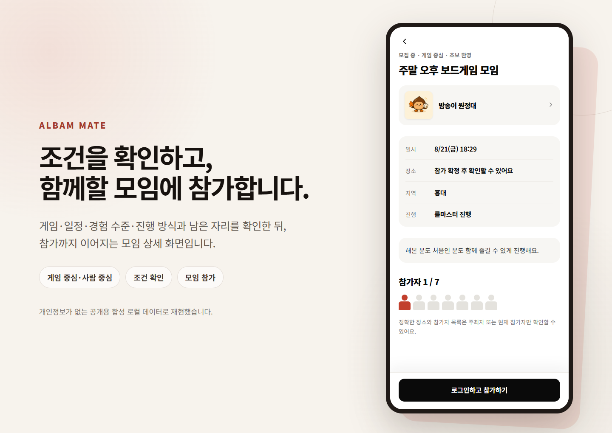
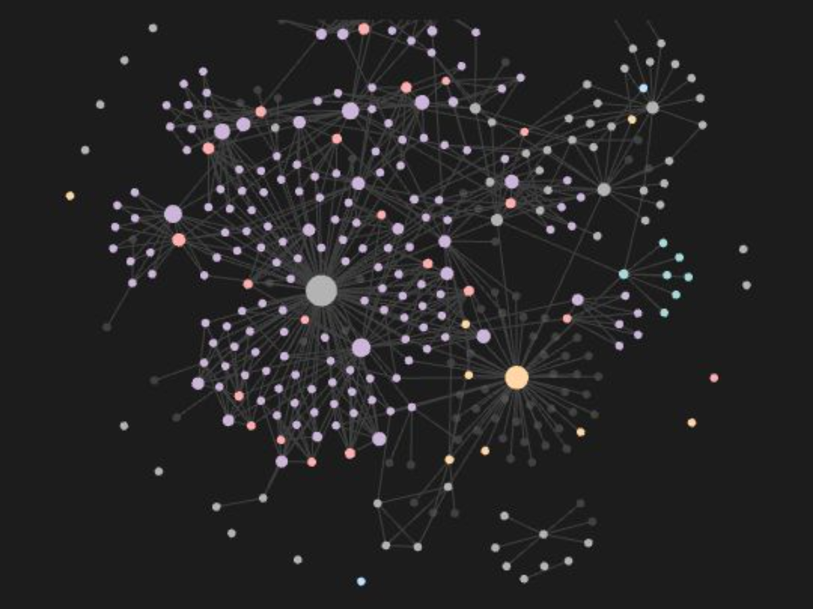

# 밤송이클럽

**백엔드 문제를 코드와 측정으로 풀어가는 4인 개발팀입니다.**

**1차 개발 기간:** 2026.07.21–2026.08.24

알밤메이트를 만들며 각자 맡은 기능의 설계·구현·테스트·측정을 책임집니다.

[서비스 체험하기](https://bamsongiclub.cloud) · [프로젝트 저장소](https://github.com/bamsongi-club/albam-mate) · [로컬 실행·테스트 가이드](https://github.com/bamsongi-club/albam-mate/blob/8e25bbc6ee2c1b68aa28247b9c2fdbf7b8e88784/README.md#10분-안에-첫-green) · [Second Brain Demo](https://github.com/bamsongi-club/bamsongi-brain-demo)

## 대표 프로젝트 · 알밤메이트

보드게임 모임은 게임·일정·장소·진행 방식·남은 자리를 각각 따로 확인해야 잡을 수 있습니다.
알밤메이트는 흩어진 정보를 한 화면에 모아 참가까지 이어줍니다.

  

개인정보가 없는 공개용 합성 데이터로 재현한 화면입니다.

### 현재 상태

| 범위 | 상태 |
| --- | --- |
| 기능 | 핵심 API 17개와 React 화면 연동을 완료했습니다. |
| 검증 | 필수 기능은 API 계약, 구현, 자동 검증까지 마쳤습니다. 완료하지 못한 배포·실측 범위는 기록으로 남겼습니다. |
| 확장 | 공통 명세와 운영 관측 정책·런북을 정리했습니다. 팀원별 상세 기능은 명세와 구현을 진행하고 있습니다. |
| 공개 화면 | [bamsongiclub.cloud](https://bamsongiclub.cloud) · 2026-08-18 HTTPS 응답 확인 |

### 기술 구성

| 구분 | 기술과 구조 |
| --- | --- |
| 구조 | 도메인 중심 모듈러 모놀리스 |
| 애플리케이션 | Java 21 · Spring Boot · Spring MVC · Spring Data JPA |
| 데이터·보안 | PostgreSQL · Flyway · Redis · Spring Security · Spring Session |
| 실시간·비동기 | WebSocket · Redis Pub/Sub · Transactional Outbox |
| 검증·관측 | JUnit 5 · Testcontainers · k6 · Actuator · Micrometer OTLP |
| 부하 검증 환경 | 캠페인별 격리 AWS 스택 · App 2대 · PostgreSQL · Redis · 전용 k6 발생기 |
| 상시 데모 배포 | 단일 EC2 · 이중화와 자동 확장을 두지 않은 비용 우선 구성 |

[현재 제공 상태](https://github.com/bamsongi-club/albam-mate/blob/8e25bbc6ee2c1b68aa28247b9c2fdbf7b8e88784/README.md#현재-제공-상태) · [아키텍처](https://github.com/bamsongi-club/albam-mate/blob/8e25bbc6ee2c1b68aa28247b9c2fdbf7b8e88784/docs/ARCHITECTURE.md)

## 팀

| 팀원 | 담당 영역 |
| --- | --- |
| 임지호 · [@vanilalatte03](https://github.com/vanilalatte03) | 인증·사용자 / 알림·Outbox / CI·AI 협업 체계 |
| 한예진 · [@beyejin](https://github.com/beyejin) | 게임 카탈로그·검색 / 소셜 로그인·계정 연결 / 인기 게임 랭킹 |
| 양지원 · [@gone09-sketch](https://github.com/gone09-sketch) | ROOM 생명주기·상태 보정 / 대기열·동시성 검증 |
| 전은기 · [@silverThunder09](https://github.com/silverThunder09) | 채팅·WebSocket / 방 참가 / 인프라·배포 |

프론트엔드 화면과 기능 간 통합 테스트는 네 명이 함께 진행합니다.

## 팀원별 문제 해결과 판단

### 임지호 · Redis 연결 재사용

16 req/s 로그인 부하에서 Primary Redis 연결을 재사용하지 않아 요청마다 TCP 연결이 생겼습니다.
정상 로그인도 `503`을 받았고, 해제되지 못한 verification gate가 후속 요청을 `429`로 거절했습니다.
연결 공유만 바꾼 A/B에서 Redis accepted connections는 10,464건에서 77건으로, HTTP `503`은 473건에서
0건으로 줄었습니다. Redis 장애 중 fail-closed와 복구 후 새 요청 성공을 회귀 테스트로 고정하고,
병합 후 8·16 req/s를 각각 15분씩 3회 측정해 모두 통과했습니다.
[Issue #710](https://github.com/bamsongi-club/albam-mate/issues/710) · [수정 PR #711](https://github.com/bamsongi-club/albam-mate/pull/711) · [병합 후 측정](https://github.com/bamsongi-club/albam-mate/issues/710#issuecomment-5291984819)

### 한예진 · 게임명 부분 검색에 GIN 적용

17만 건 카탈로그에서 같은 조건으로 `pg_trgm` GIN 인덱스 적용 전후를 비교했습니다. 검색 단독 시나리오의
p95는 3,034.1 ms에서 9.7 ms로 줄었지만, 여러 조회를 섞은 부하는 인덱스 적용 뒤에도 기준을 넘었습니다.
측정 결과에 따라 이름 부분 검색에 GIN을 도입하고 Flyway 마이그레이션과 PostgreSQL 회귀 테스트에
반영했습니다. 혼합 부하의 병목은 별도 과제로 남겼습니다.
[검색 인덱스 판단](https://github.com/bamsongi-club/albam-mate/blob/8e25bbc6ee2c1b68aa28247b9c2fdbf7b8e88784/docs/measurements/k6/yejin/keyword-search-index-decision-2026-08-11.md) · [Flyway 마이그레이션](https://github.com/bamsongi-club/albam-mate/blob/8e25bbc6ee2c1b68aa28247b9c2fdbf7b8e88784/src/main/resources/db/vendor-migration/postgresql/V26__add_game_name_trigram_index.sql)

### 양지원 · 정원과 대기열의 동시성 검증

전용 AWS 환경에서 취소 후 FIFO 자동 승격과 동시 대기 등록을 포함한 ROOM 시나리오 25개를 실행했습니다.
25개 모두 DB 불변식을 지켰고 예상 밖 4xx와 서버·계약 실패는 0건이었습니다. 마지막 자리 c8 조건에서는
40개 요청 중 5개가 성공하고 35개가 허용된 업무 결과로 끝났으며, 최종 상태에 정원 초과와 의도하지 않은
자동 대기는 없었습니다. 반면 같은 ROOM에 경합이 몰린 자동 승격과 대기 등록은 허용된 동시성 결과가
각각 23/40과 20/40이었습니다. 정합성을 지킨 것과 경합 비용이 낮은 것은 다르므로 이 구간을 다음 반복
측정의 우선순위로 남겼습니다.
[ROOM 동시성 측정](https://github.com/bamsongi-club/albam-mate/blob/8e25bbc6ee2c1b68aa28247b9c2fdbf7b8e88784/docs/measurements/k6/jiwon/room-portable-bundle-05-final-valid-2026-08-15.md)

### 전은기 · 채팅 연결과 전달을 나눠 측정

채팅 부하를 연결 성립·세션 정상·메시지 전달로 나눠 확인했습니다. 18개 WebSocket을 동시에 연결한
조건에서는 8개만 성립했지만, 같은 release에서 연결 수를 단계적으로 늘린 조건은 170개가 모두
성립했습니다. 이 차이를 근거로 채팅 용량을 하나의 성공률로 묶지 않고, 동시 handshake의 DB connection
pool 병목과 전달 실패를 각각 다른 후속 검증 범위로 나눴습니다.
[채팅 반복 측정](https://github.com/bamsongi-club/albam-mate/blob/8e25bbc6ee2c1b68aa28247b9c2fdbf7b8e88784/docs/measurements/k6/eungi/chat-delivery-capacity-2026-08-13-repeat2.md)

## 회의 기록을 결정으로 바꾸는 과정

**회의 원문 보존 → 결정 후보 정리 → 프로젝트 근거 대조 → 사람 검수**

회의록을 곧바로 결정으로 올리지 않습니다. AI는 후보 탐색과 초안을 보조하고, 사실 판정과 채택·보류·공개
여부는 사람이 정합니다.

  

실제 팀 운영에 사용한 Private Second Brain의 그래프입니다. 2026-08-18 캡처 · 문서 제목·본문·내부 경로 미표시

공개한 [Bamsongi Brain Demo](https://github.com/bamsongi-club/bamsongi-brain-demo)는 실제 자료를 복제하거나
익명화한 저장소가 아닙니다. 합성 자료와 공개 GitHub 근거로 같은 운영 흐름을 재현했습니다.

[Demo 실행 방법](https://github.com/bamsongi-club/bamsongi-brain-demo#4-직접-실행할-명령) · [사람이 승인한 실제 사례](https://github.com/bamsongi-club/bamsongi-brain-demo/blob/main/case-studies/albam-mate-decision-state-vs-verification-state.md)
